**Trabajo fin de Ciclo Complementario**

**Licenciatura en Ciencia de Datos**

**Benchmark de LLMs desde la perspectiva de indicadores lingüísticos aplicados a las respuestas**

**Director de la Carrera:** German Giro

**Profesor:** Alejandro Hernández

**Alumno:** Norberto Emanuel Vicente Giannattasio

Contenido

[Introducción 3](#_Toc168581274)

[Que es un Modelo de Lenguaje Grande ( Large Language Model) 3](#_Toc168581275)

[Brevísima historia de los LLM 4](#_Toc168581276)

[Consideraciones Iniciales 5](#_Toc168581277)

[Objetivo 5](#_Toc168581278)

[Consideraciones acerca de Frameworks de pruebas actuales. 5](#_Toc168581279)

[Selección de LLMs 6](#_Toc168581280)

[Herramientas Utilizadas 6](#_Toc168581281)

[Propuesta de Framework de Benchmark para LLMs 8](#_Toc168581282)

[Descripción del experimento 8](#_Toc168581283)

[Prompts de experimentación 8](#_Toc168581284)

[Respuestas a los Prompts de experimentación por parte de los LLM 9](#_Toc168581285)

[Indicadores seleccionados 10](#_Toc168581286)

[Análisis y Comparaciones de indicadores aplicados 11](#_Toc168581287)

[Análisis indicadores numéricos 11](#_Toc168581288)

[Análisis Sentimientos 16](#_Toc168581289)

[Conclusiones 17](#_Toc168581290)

[Apéndice A: Detalles Técnicos del Entorno de Experimentación 17](#_Toc168581291)

[Referencias 18](#_Toc168581292)

# Introducción

No nos sumergimos mucho en los basamentos teórico técnicos de los Modelos de Lenguaje Grande (LLM), ya que no es el objetivo de este trabajo, pero haremos una breve introducción describiendo qué son los LLM y una breve historia acerca de los mismos.

## Que es un Modelo de Lenguaje Grande ( Large Language Model)

Los LLMs o Modelos de Lenguaje Grande (LLM desde este momento por sus siglas en inglés) son algoritmos avanzados de aprendizaje profundo capaces de realizar una amplia gama de tareas relacionadas con el procesamiento del lenguaje natural (NLP).

La diferencia que todos hemos notado desde finales de 2022 o principios de 2023 estriba en el tamaño y cantidad de datos de entrenamiento. Los nuevos modelos, cimentados en la arquitectura Transformers —actualmente la más popular—, se entrenan con vastos conjuntos de datos, lo que les confiere una impresionante habilidad para reconocer, resumir, traducir, predecir y generar texto. Si además añadimos una funcionalidad de chatbot para interactuar, como lo hizo OpenAI con ChatGPT, Meta con Llama2 o Google con Gemini, entonces tenemos una experiencia nueva, una experiencia cognitiva que los humanos no habíamos tenido con ninguna máquina. Esa es la razón por la que nos divertimos y “enganchamos” tanto a los modelos como ChatGPT: para nuestro cerebro, estamos teniendo **una experiencia cognitiva**, una conversación, como la podríamos tener con un bibliotecario de amplísimos conocimientos o cualquier otra persona.

Es fundamental distinguir entre los LLMs y la AI generativa. Mientras que los LLMs se centran en el texto, la AI generativa abarca un espectro más amplio, multimodal, incluyendo la creación de imágenes, música y más. Todos los LLMs pueden considerarse parte de la AI generativa, pero no toda AI generativa es un LLM.

A modo de ejemplo, [Claude2](https://www.anthropic.com/index/claude-2) de Anthropic, Gemini de Google, y los famosos ChatGPT o Llama2 (o 3) son LLMs, mientras que [Stable Diffusion](https://stablediffusionweb.com/) o Bing Image Creator de Microsoft, basado en Dall-e 3, son AI Generativa pero producen imágenes, no son grandes modelos de lenguaje.

Algunos ejemplos de modelos de lenguaje grandes populares incluyen:

- **ChatGPT:** un chatbot de inteligencia artificial generativa desarrollado por OpenAI.
- **PaLM:** Pathways Language Model (PaLM) de Google, un modelo de lenguaje de transformadores capaz de realizar razonamientos aritméticos y de sentido común, explicar bromas, generar código y traducir.
- **BERT:** el modelo de lenguaje representación de codificador bidireccional de transformadores (BERT) también se desarrolló en Google. Es un modelo basado en transformadores que puede comprender el lenguaje natural y responder preguntas.
- **XLNet:** un modelo de lenguaje de permutación, XLNet generó predicciones de salida en un orden aleatorio, lo que lo distingue de BERT. Evalúa el patrón de tokens codificados y luego predice los tokens en orden aleatorio, en lugar de en un orden secuencial.
- **GPT:** los transformadores generativos pre entrenados son quizá los modelos de lenguaje grandes más conocidos. Desarrollados por OpenAI, GPT es un modelo fundacional popular cuyas iteraciones numeradas son mejoras de sus predecesores (GPT-3, GPT-4, etc.).

Además, de estos modelos de lenguaje también es preciso mencionar los conocidos como LLM de código abierto como ser:

[Llama2 (o 3)](https://llama.meta.com/) de Meta ( este a su vez posee una versión específica para la generación o corrección de código de programación llamada [CodeLlama](https://ai.meta.com/blog/code-llama-large-language-model-coding/)), [Gemma](https://ai.google.dev/gemma?hl=es-419) de Google ( este LLM también posee una versión específica para la generación y corrección de código de programación llamada [CodeGemma](https://ai.google.dev/gemma/docs/codegemma?hl=es-419)) o [Mistral](https://docs.mistral.ai/) de la compañía francesa del mismo nombre.

## Brevísima historia de los LLM

Los LLM existen desde hace algunas décadas, pero hace poco se volvieron lo suficientemente potentes y sofisticados como para que se los use en una amplia gama de tareas. El primer LLM se creó en la década de los sesenta con el primer chatbot, Eliza. Sin embargo, sus capacidades eran muy limitadas. No fue hasta la década de 2010 cuando los LLM maduraron hasta alcanzar un nivel de funcionalidad adecuado para modelos muy grandes y aplicaciones del mundo real.

Un momento crucial en el avance de LLM llegó con la introducción de la arquitectura [Transformer](https://aws.amazon.com/es/what-is/transformers-in-artificial-intelligence/) en 2017. El modelo de Transformer mejoró significativamente la comprensión de las relaciones de palabras dentro de oraciones, lo que dio como resultado una generación de texto que sea gramaticalmente correcta y semánticamente coherente.

En los últimos años, se pre entrenó a los LLM con amplios conjuntos de datos de cientos de miles de millones de textos y códigos, lo que ha permitido mejorar sustancialmente su rendimiento en diversas tareas. Por ejemplo, algunos LLM ahora pueden generar texto indistinguible del texto escrito por humanos.

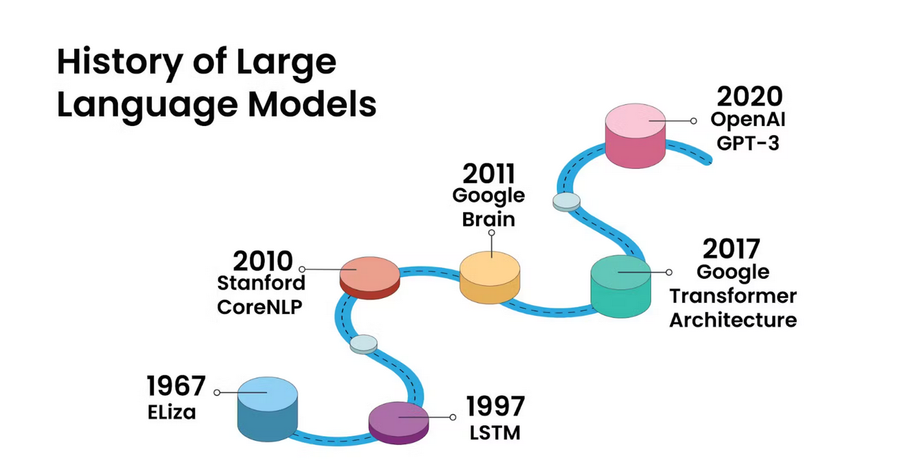

# Consideraciones Iniciales

## Objetivo

El objetivo del presente trabajo es el desarrollo de un framework de comparación independiente para LLMs utilizando diversas herramientas del ambiente Open Source

## Consideraciones acerca de Frameworks de pruebas actuales

La evaluación de los LLM es un ámbito incipiente y abierto a experimentación y creación, dentro de este campo existen algunos frameworks/librerías para evaluar las respuestas de lo LLM, entre las principales podemos mencionar

- [Uptrain](https://github.com/uptrain-ai/uptrain)
- [Ragas](https://docs.ragas.io/en/stable/)
- [DeepEval](https://docs.confident-ai.com/)

En las evaluaciones previas, se verificó que estos frameworks de test, necesitan una Key para utilizar la plataforma de OpenAI (Excepto Uptrain) para utilizar el api abierta de esta compañía (la creadora de ChatGPT) y además están desarrolladas para evaluar un LLM contra el de la compañía OpenAI y obtener las métricas en base a ellos. (Podríamos detallar el uso de estos, pero sería tema de un paper al completo).

Por esta razón es que se decidió desarrollar una serie de métricas para realizar la evaluación de un LLM frente a otro, también es de mencionar, que para no largar el desarrollo del presente documento, no ahondaremos en los detalles teóricos que le dan sustento a cada uno de los indicadores seleccionados para realizar la comparativa.

## Selección de LLMs

Por esta razón es que se decidió desarrollar una serie de métricas para realizar la evaluación de un LLM frente a otro.

Se eligieron los LLM Open Source de dos de las compañías de tecnología más grandes e innovadoras Llama2 de Meta y Gema de Google, en ambos casos, para que la comparación/benchmark sea justo, se eligieron las versiones que fueron entrenadas con 7 billones de parámetros en cada caso; es decir la parametrización de entrenamiento de ambos modelos de LLM, a nivel numérico cuantitativo son idénticas (no tenemos certeza si son los mismos sets de parámetros a nivel cualitativo).

Se Omitió la versión más nueva del Modelo Llama, llama3, ya que este está entrenado con 8 billones de parámetros y la comparativa no sería matemáticamente correcta, ya que esta versión del modelo posee una ventaja de mil millones de parámetros sobre la versión de Google.

## Herramientas Utilizadas

En esta sección, antes de presentar los detalles y resultados del framework propuesto y de las pruebas realizadas, procederemos a mencionar las herramientas utilizadas:

- **Python:** Se eligió Python como lenguaje de programación, ya que hoy es el estándar de facto en el mundo de datos por sobre otros como Scala o R. Además de ser un lenguaje de programación Open Source y con una enorme comunidad y documentación accesible.
- **Ollama:** es una herramienta que nos permite ejecutar modelos de lenguaje en nuestros ordenadores de manera sencilla. Su principal propósito es facilitar el acceso a modelos de gran tamaño sin necesidad de utilizar la nube. Con Ollama, podemos descargar y ejecutar varios modelos, incluyendo LLaMA-2, Uncensored LLaMA, CodeLLaMA, Falcon y Mistral, entre otros.
- **SQLite:** es un sistema de gestión de bases de datos relacional compatible con ACID, contenida en una relativamente pequeña biblioteca escrita en C. SQLite es un proyecto de dominio público creado por D. Richard Hipp.
- **TextStat:** Paquete de Python para calcular estadísticas a partir de texto y determinar la legibilidad, complejidad y nivel de grado de un corpus específico.
- **TextBlob:** TextBlob es una biblioteca de Python para procesar datos textuales. Proporciona una API simple para realizar tareas comunes de procesamiento de lenguaje natural (PLN) como el etiquetado de partes del discurso, la extracción de sintagmas nominales, el análisis de sentimiento, la clasificación y más. Particularmente se utilizará para el análisis de sentimientos.
- **Langdetect:** Librería que permite la detección del lenguaje de un texto.
- **NLTK (Natural Language Toolkit):** Es una plataforma líder para construir programas de Python que trabajan con datos de lenguaje humano. Proporciona interfaces fáciles de usar para más de 50 corpus y recursos léxicos como WordNet, junto con un conjunto de bibliotecas de procesamiento de texto para clasificación, tokenización, derivación, etiquetado, análisis sintáctico y razonamiento semántico. También incluye envoltorios para bibliotecas de PNL de uso industrial.
- **Google Colab:** también conocido como Colaboratory, es un servicio gratuito de Jupyter Notebook alojado en la nube que te permite ejecutar código Python sin necesidad de configuración.
- **VsCode:** es un editor de código fuente gratuito y de código abierto desarrollado por Microsoft, altamente configurable, personalizable y extensible mediante plugin
- **Plotly Express**: es una biblioteca de Python para crear visualizaciones de datos interactivas de forma rápida y sencilla.
- **Ngrok:** es una herramienta que permite exponer un servidor local a Internet de forma rápida y sencilla. Funciona creando un túnel seguro entre tu computadora y los servidores de Ngrok, lo que te permite acceder a tu servidor desde cualquier lugar del mundo con una URL pública.

# Propuesta de Framework de Benchmark para LLMs

## Descripción del experimento

El experimento consta del envío de una cantidad finita de prompts a los LLMs, los cuales otorgaran una respuesta a los mismos. Los prompts enviados a LLMs serán los mismos en cada caso.

Las respuestas se almacenarán en una base de datos; de cada respuesta se obtendrán estadísticas léxicas para cada respuesta de cada LLM y se realizarán comparaciones entre las mismas, obteniendo indicadores particulares con los que se llegara a la conclusión de que LLM fue más performante de acuerdo a las mismas.

## Prompts de experimentación

A continuación, se presentan los prompts de experimentación que se enviaron a cada LLM para evaluar sus respuestas.

Como se observa, para la presente “prueba de concepto” sólo se han desarrollado 10 prompts los cuales se enviaron a los LLM seleccionados para evaluar sus respuestas. Estos se dividieron en 3 tipos de complejidad; baja (2), media (5) y alta (3)

| **id_promtp** | **complejidad** | **prompt** |
| --- | --- | --- |
| 1   | Baja | Buenos días, ¿me podrías ayudar con algo hoy? |
| 2   | Baja | ¿Cuál es la capital de Francia? |
| 3   | Media | Estoy planeando un viaje a Argentina. ¿Podrías recomendarme algunos lugares para visitar? |
| 4   | Media | Por favor, podrías escribir un artículo sobre la inteligencia artificial de no más de 300 palabras |
| 5   | Media | Traduce este texto ""Crónicas Marcianas" de Ray Bradbury es una colección de relatos que exploran la colonización humana en Marte. Con una prosa poética y visionaria, Bradbury teje historias emotivas sobre la soledad, la nostalgia y la naturaleza humana a través de encuentros imaginativos entre colonizadores y marcianos. Cada relato revela la fragilidad de la existencia y la búsqueda de significado en un mundo alienígena, mientras refleja paralelos con la condición humana en la Tierra. Esta obra maestra de la ciencia ficción cautiva con su estilo evocador y su capacidad para trascender lo tecnológico, adentrándose en lo más profundo del alma humana." del español al inglés. |
| 6   | Media | Escribe un poema sobre el libertad |
| 7   | Media | Escribe un guión para un cortometraje de comedia. |
| 8   | Alta | Escribe un código en Python que imprima "Hola, mundo!" en la consola. |
| 9   | Alta | Utiliza Pandas para analizar este conjunto de datos y generar un gráfico de barras. |
| 10  | Alta | Crea una función en PySpark que calcule la media de un campo en un conjunto de datos. |

Tabla 1 - Prompts de test

El prompt número 5, se envió un breve texto para que se le realice una traducción del español al inglés. La respuesta en ese caso debe ser en inglés, en los demás casos, la respuesta debe ser en castellano para ser evaluada como correcta, en caso contrario, se marcará como errónea y ese registro no será tenido en cuenta para las estadísticas que se obtienen.

##

##

## Respuestas a los Prompts de experimentación por parte de los LLM

- [Respuestas Gemma](https://github.com/EmaGianna/LLM_Benchmark/blob/main/prompts/csv/respuestas_gemma.csv)
- [Respuestas Llama2](https://github.com/EmaGianna/LLM_Benchmark/blob/main/prompts/csv/respuestas_llama.csv)

## Indicadores seleccionados

- **Tiempo de lectura (Reading Time):** Indica el tiempo aproximado de lectura del texto.
- **Conteo de oraciones (Sentence Count):** Es el número de oraciones que se encuentran en el texto.
- **Conteo de Caracteres (Character Count):** Es el número de caracteres que se encuentran en el texto (esto incluye signos de puntuación)**.**
- **Conteo de letras (Letter Count):** Es el número de caracteres que se encuentran en el texto (esto excluye signos de puntuación)**.**
- **Conteo de palabras (Lexicon count):** Es la cantidad de palabras presentes en el texto.
- **Largo promedio de oraciones (Average sentence length)** : Es el largo promedio de las oraciones medido en cantidad de palabras en la misma.
- **Promedio de letras por palabra (Average letters per Word):** Es el número promedio de letras por palabras en el texto.
- **Cantidad de Stopwors (Quantity Stopwords):** Es la cantidad de stopwords contenidas en el texto.
- **Cantidad de Palabras (Quantity Words):** Es la cantidad de palabras presentes en el texto.
- **Densidad Léxica (Lexical Density):** Es la densidad léxica, calculada como la cantidad de palabras sin repetición dividido por la cantidad total de palabras
- **Riqueza Léxica (Lexical Richness):** Es la densidad léxica expresada en porcentajes al multiplicar la mencionada por 100.
- **Análisis de Sentimiento (Analyze Sentiment):** Es el valor que se obtiene del análisis de sentimientos expresado en Neutro, Negativo, Positivo.

## Análisis y Comparaciones de indicadores aplicados

### Análisis indicadores numéricos

En la siguiente tabla observamos el resultado de la comparación de los indicadores numéricos calculados, para cada registros prueba, y se obtiene

en cada caso cuál de los LLMs dio mejor respuesta por sobre todo ( campos llama_better y gemma_better); también se verifica si en algún caso la respuesta tuvo la misma performance ( campo equals). En la columna final hacemos la sumarización que debe ser 10, ya que los prompts enviados para testar fueron 10.

El último registro, el indicador “total_sum” es un totalizador de cada columna.

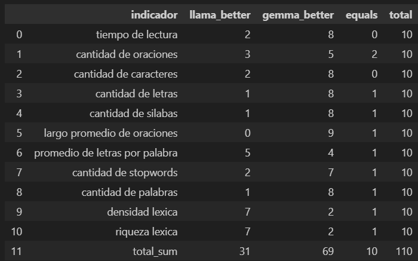

tabla 2- comparación y sumarización de indicadores.
  

A continuación, se agregó a la tabla anterior, los valores expresados de modo porcentual (columnas (llama_better_percent, gemma_better_percent y equal). En los porcentajes totales, el cálculo se realizó de la siguiente manera:  

**_(total sumarizado para ese llm/el valor total) \*100 = % registro total_sum_**

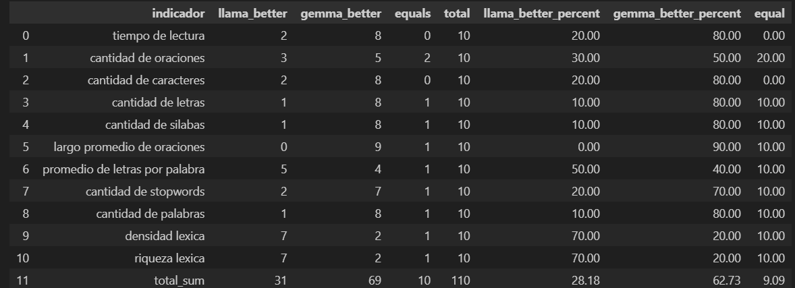

tabla 3- comparación y sumarización de indicadores.

A continuación, se logra observar de manera gráfica, la comparación entre los resultados obtenidos por cada una de las respuestas de ambos LLMs a los 10 prompts de test, que anteriormente se presentaron en forma numérica

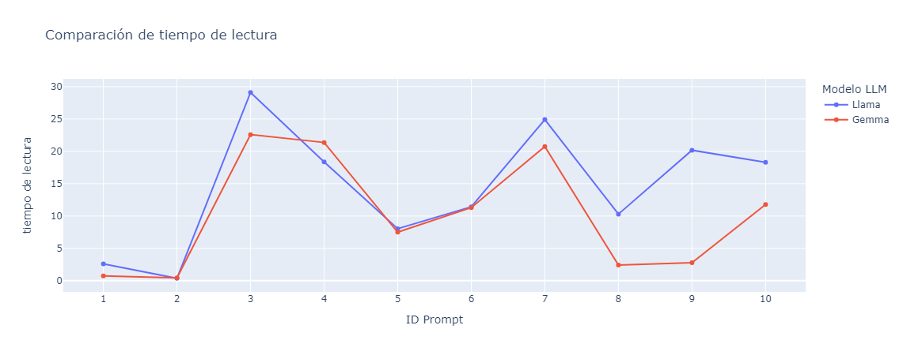

Fig 1 - Comparación tiempo de lectura

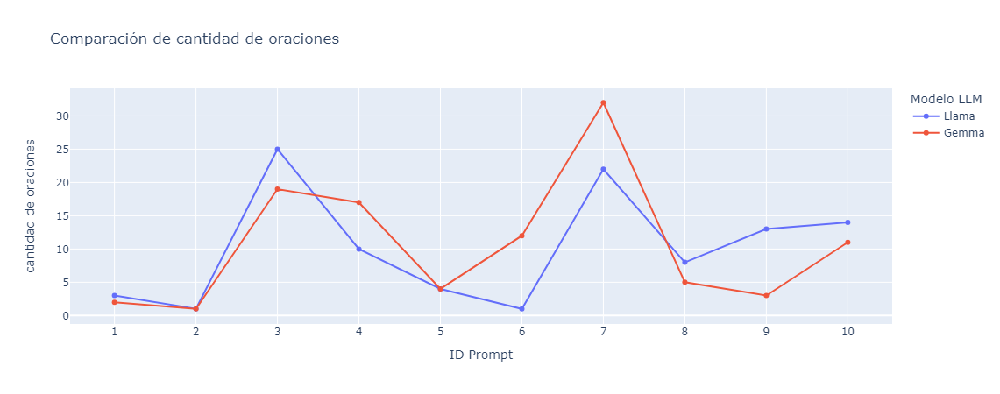

Fig 2 - Comparación cantidad de oraciones

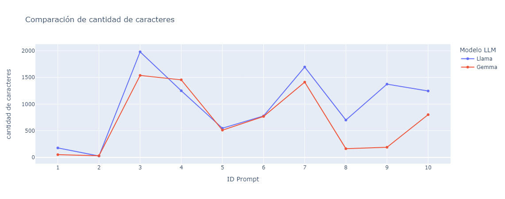

Fig 3 - Comparación cantidad de caracteres

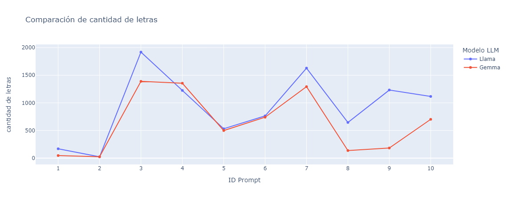

Fig 4 - Comparación cantidad de letras

Fig 5 - Comparación cantidad de sílabas

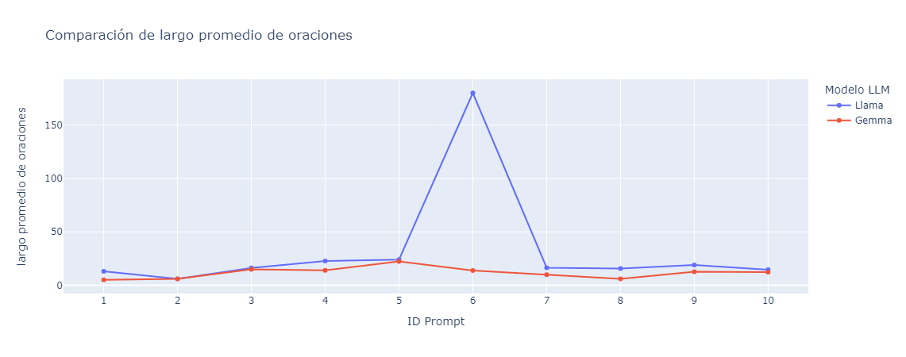

Fig 6 - Comparación largo promedio de oraciones

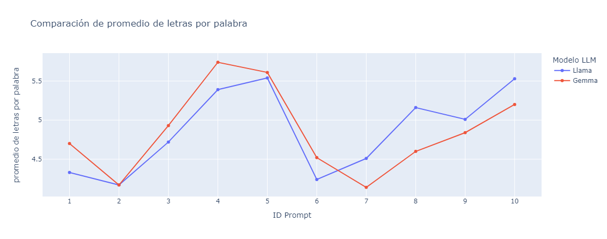

Fig 7 - Comparación promedio de letras por palabra

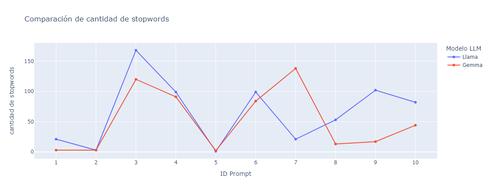

Fig 8 - Comparación cantidad de stopwords

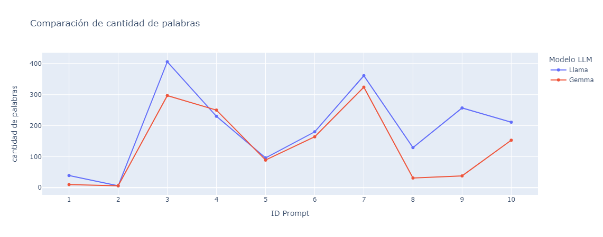

Fig 9 - Comparación cantidad de palabras

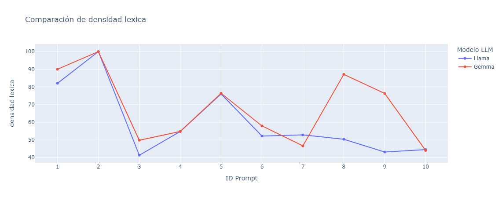

Fig 10 - Comparación densidad léxica

Fig 11 - Comparación riqueza léxica

### Análisis Sentimientos

En esta sección evaluamos, mediante el análisis de sentimientos, la “cordialidad” de cada respuesta de los LLMs

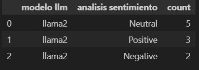

tabla 4 - análisis de sentimiento de llama2

Fig 12 - Distribución del análisis de sentimiento para llama2

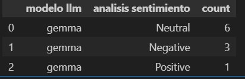

tabla 5 - análisis de sentimiento de gemma

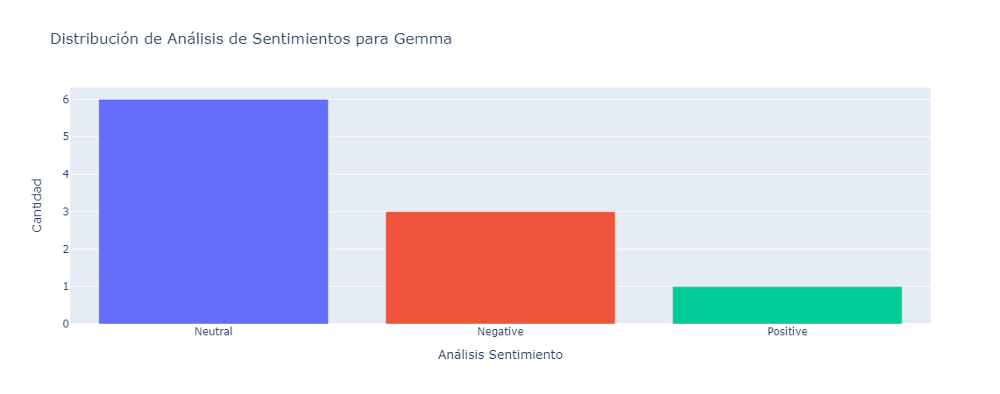

Fig 13 - Distribución del análisis de sentimiento para gemma

## Conclusiones

# Apéndice A: Detalles Técnicos del Entorno de Experimentación

(En desarrollo)

[https://github.com/EmaGianna/LLM_Benchmark](https://github.com/EmaGianna/LLM_Benchmark/blob/main/nbk/prompt_experiment.ipynb)

# Referencias

<https://www.aprendemachinelearning.com/llm-que-son-los-grandes-modelos-de-lenguaje/>

<https://www.mongodb.com/es/resources/basics/large-language-models>

<https://aws.amazon.com/es/what-is/transformers-in-artificial-intelligence/>

<https://ai.meta.com/blog/code-llama-large-language-model-coding/>

<https://ai.google.dev/gemma/docs/codegemma?hl=es-419>

<https://ollama.com/>

<https://www.sqlite.org/>

<https://pypi.org>

<https://pypi.org/project/textstat/>

<https://pypi.org/project/textblob/>

<https://pypi.org/project/langdetect/>

<https://www.nltk.org/>

<https://plotly.com/python/plotly-express/>

<https://colab.research.google.com/>

<https://visualstudio.microsoft.com/es/#vscode-section>

<https://ngrok.com/>

<https://word2md.com/>